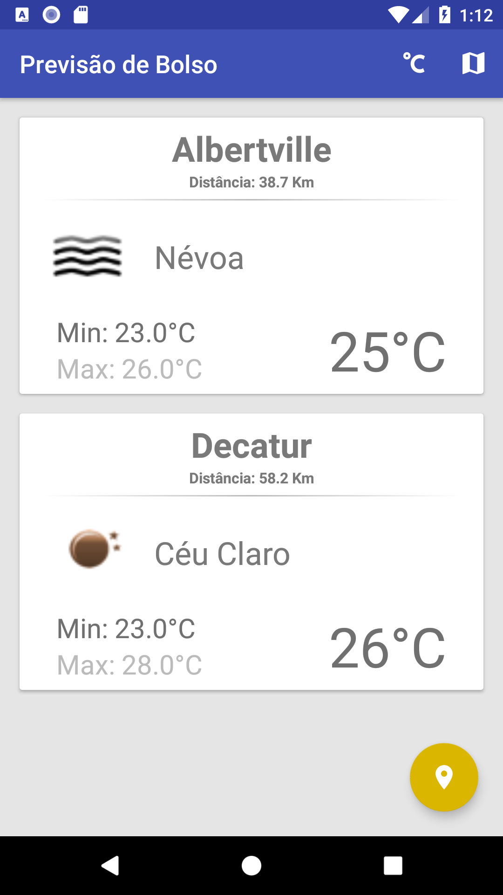
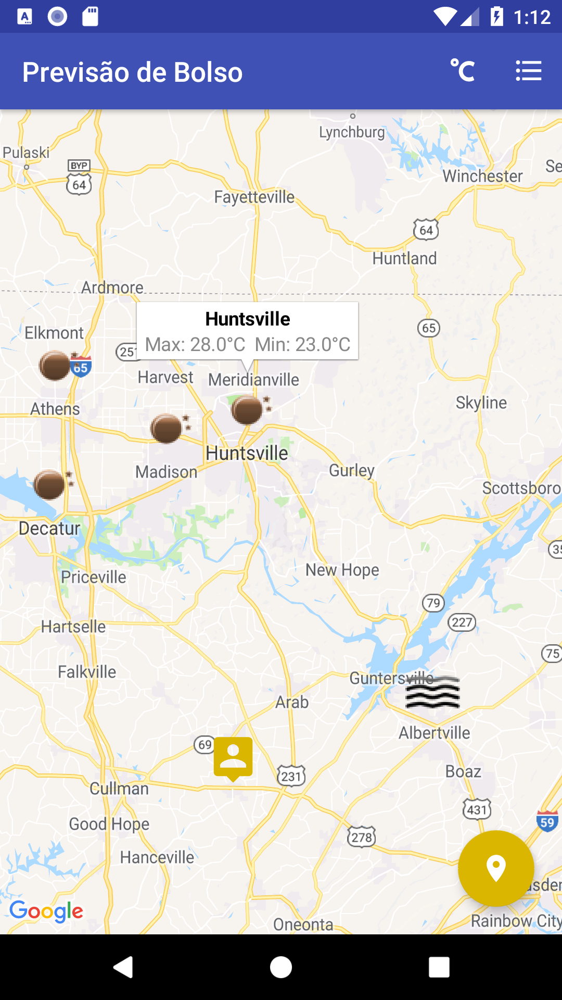

# Weather For All
### About The App
With Weather For All you will always know the most relevant weather forecasts!
### Libraries Used
* Google Maps - https://developers.google.com/android/guides/setup
* Google Location - https://developers.google.com/android/guides/setup
* Retrofit - https://github.com/square/retrofit
* Retrofit Gson Converter - https://github.com/square/retrofit/tree/master/retrofit-converters/gson
* OkHttp Logging Interceptor - https://github.com/square/okhttp/tree/master/okhttp-logging-interceptor
* Picasso - https://github.com/square/picasso
### Screenshots

  
   
  

